# Quantum-Safe Zero Trust Device Identity & Attestation System

> **Post-quantum ready device identity pipeline built on AWS with automated certificate lifecycle management and compliance monitoring**

## System Architecture Overview


##  Detailed Workflow Breakdown

### Device Onboarding Flow

```mermaid
sequenceDiagram
    participant Device as 🔒 IoT Device
    participant API as ⚡ API Gateway
    participant Onboard as λ Onboard Lambda
    participant S3_CSR as 📦 S3 CSR Bucket
    participant Issuer as λ Cert Issuer Lambda
    participant PCA as 📜 ACM Private CA
    participant S3_Cert as 📦 S3 Cert Bucket
    participant DDB as 🗄️ DynamoDB
    participant CW as 📊 CloudWatch
    
    Device->>Device: Generate RSA-2048 + Kyber-512 keys
    Device->>Device: Create CSR w/ PQC extension (800 bytes)
    Device->>API: POST /onboard {device_id, csr}
    API->>Onboard: Invoke Lambda
    Onboard->>S3_CSR: Upload CSR (KMS encrypted)
    S3_CSR->>Issuer: S3 Event Trigger
    Issuer->>Issuer: Parse ASN.1 DER encoding
    Issuer->>Issuer: Extract Kyber-512 public key
    Issuer->>Issuer: Validate PQC extension (OID check)
    Issuer->>PCA: IssueCertificate (custom template)
    PCA-->>Issuer: X.509 Certificate w/ PQC extension
    Issuer->>S3_Cert: Store certificate
    Issuer->>DDB: Write device record {compliance_state: "pqc_ok"}
    Issuer->>CW: Emit PQCCompliance metric
    Issuer->>CW: Emit CertificateIssuance metric
    Issuer-->>Device: 200 OK {certificate_arn, compliance_state}
```



###  Device Attestation Flow

```mermaid
sequenceDiagram
    participant Device as 🔒 IoT Device
    participant API as ⚡ API Gateway
    participant Attest as λ Attestation Lambda
    participant DDB as 🗄️ DynamoDB
    participant S3_Cert as 📦 S3 Cert Bucket
    participant CW as 📊 CloudWatch
    
    Device->>API: POST /attest {device_id}
    API->>Attest: Invoke Lambda
    Attest->>Attest: Generate challenge nonce (32 bytes)
    Attest-->>Device: Return challenge
    Device->>Device: Sign challenge w/ RSA-PSS private key
    Device->>Attest: Submit signature
    Attest->>DDB: Query device state
    DDB-->>Attest: {compliance_state, certificate_arn}
    Attest->>S3_Cert: Retrieve certificate
    S3_Cert-->>Attest: X.509 certificate
    Attest->>Attest: Extract RSA public key
    Attest->>Attest: Verify RSA-PSS signature
    Attest->>Attest: Validate compliance match
    Attest->>DDB: Update last_attested timestamp
    Attest->>CW: Log attestation result
    Attest-->>Device: 200 OK {verified: true, compliance_state}
```



### Compliance Monitoring Dashboard


## Key Components Explained

### Post-Quantum Cryptography Integration


### Security Architecture & Zero Trust Model

```mermaid
graph TB
    subgraph Network["🌐 Network Layer"]
        VPC[VPC: 10.0.0.0/16]
        Private1[Private Subnet A<br/>10.0.1.0/24]
        Private2[Private Subnet B<br/>10.0.2.0/24]
        NAT[NAT Gateway<br/>Outbound Only]
    end
    
    subgraph Identity["🔑 Identity & Access"]
        IAM1[Device Role<br/>S3 CSR Upload Only]
        IAM2[Lambda Exec Role<br/>Scoped Permissions]
        IAM3[Admin Role<br/>Emergency Access Only]
    end
    
    subgraph Encryption["🔒 Encryption"]
        KMS1[KMS: S3 Encryption]
        KMS2[KMS: DynamoDB Encryption]
        KMS3[KMS: PCA Signing Key<br/>Hybrid RSA-ECC]
        TLS[TLS 1.3<br/>API Gateway]
    end
    
    subgraph Monitoring["👁️ Observability"]
        CT[CloudTrail<br/>All API Calls]
        CWL[CloudWatch Logs<br/>Encrypted w/ KMS]
        CWA[CloudWatch Alarms<br/>Security Events]
    end
    
    VPC --> Private1
    VPC --> Private2
    Private1 --> NAT
    Private2 --> NAT
    
    IAM1 -.->|Least Privilege| Private1
    IAM2 -.->|Scoped Access| Private2
    
    KMS1 -.->|Encrypt| Private1
    KMS2 -.->|Encrypt| Private2
    TLS -.->|Secure Transit| VPC
    
    CT -.->|Audit| Monitoring
    CWL -.->|Log| Monitoring
    
    style Network fill:#1a1a2e,stroke:#3a86ff,stroke-width:3px,color:#fff
    style Identity fill:#1a1a2e,stroke:#00ffcc,stroke-width:3px,color:#fff
    style Encryption fill:#1a1a2e,stroke:#ff006e,stroke-width:3px,color:#fff
    style Monitoring fill:#1a1a2e,stroke:#ffbe0b,stroke-width:3px,color:#fff
```



## Compliance States


## Data Flow & Encryption


---

**Built with AWS managed services, Terraform, and NIST-recommended post-quantum cryptography**

---

##  Overview

This project implements a **fully automated, enterprise-grade Zero Trust identity system** for IoT/device fleets using AWS managed services and post-quantum cryptography (PQC). 

The system provisions device credentials, validates PQC readiness, issues X.509 certificates via AWS ACM Private CA, performs cryptographic attestation challenges, and monitors compliance states across the device lifecycle.

**Key Innovation:** Embeds Kyber-512 post-quantum public keys as X.509 certificate extensions, enabling **hybrid cryptographic identity** that is quantum-resistant while remaining backward compatible with existing PKI infrastructure.

---

## Core Features

### Identity & Certificate Management
- **Device Onboarding API** - REST endpoints for secure device registration
- **Hybrid RSA + PQC Key Generation** - Kyber-512 post-quantum keys embedded in CSRs
- **Automated Certificate Issuance** - AWS ACM PCA integration with subordinate CA chain
- **Certificate Lifecycle Management** - S3-driven event pipeline for CSR processing

### Security & Compliance
-  **PQC Capability Detection** - Extracts and validates Kyber-512 public keys from certificate extensions
-  **Challenge-Response Attestation** - Cryptographic proof of device identity
-  **Compliance State Tracking** - Real-time classification (`pqc_ok` vs `legacy`)
-  **Zero Trust Architecture** - Least privilege IAM policies, KMS encryption, private subnets

### Observability
- **CloudWatch Dashboard** - Fleet-wide monitoring with custom PQC compliance metrics
- **Structured Logging** - Lambda execution traces with detailed CSR parsing output
- **Automated Alarms** - Error detection and notification for pipeline failures

---

##  Architecture


### Architecture Highlights

| Layer | Services | Purpose |
|-------|----------|---------|
| **API & Compute** | API Gateway, Lambda (Python 3.9) | RESTful device endpoints, serverless processing |
| **PKI** | ACM Private CA (Root + Subordinate) | Certificate authority hierarchy, cert issuance |
| **Cryptography** | KMS, Kyber-512 (liboqs) | Key management, PQC key generation |
| **Storage** | S3, DynamoDB | CSR/certificate artifacts, device compliance state |
| **Networking** | VPC, Private Subnets | Zero Trust network segmentation |
| **Observability** | CloudWatch Dashboards, Logs, Metrics | Real-time monitoring, custom PQC metrics |

---

## End-to-End Workflow

###  Device Onboarding
1. Device generates hybrid keypair (RSA-2048 + Kyber-512)
2. Device creates CSR with PQC public key embedded in X.509 extension (`1.3.6.1.4.1.2.267.7.6.5`)
3. CSR uploaded to S3 bucket via API Gateway `/onboard` endpoint
4. S3 event triggers `cert_issuer` Lambda
5. Lambda extracts PQC extension, validates Kyber-512 public key
6. Lambda calls ACM PCA `IssueCertificate` with custom template
7. Certificate saved to S3 output bucket
8. Device compliance state (`pqc_ok` or `legacy`) stored in DynamoDB
9. CloudWatch metrics emitted for compliance tracking

### Device Attestation
1. Device requests challenge via `/attest` endpoint
2. Lambda generates random challenge nonce
3. Device signs challenge using RSA private key
4. Lambda retrieves device state from DynamoDB
5. Lambda verifies signature using RSA public key from certificate
6. Lambda compares signature algorithm to compliance state
7. Returns attestation result (`pqc_ok` or `legacy` with reasoning)

### Compliance Monitoring
- CloudWatch dashboard displays:
  - **PQC Compliance Pie Chart** - Fleet-wide distribution of `pqc_ok` vs `legacy`
  - **Lambda Invocations** - Onboarding and attestation request rates
  - **Certificate Issuance** - ACM PCA metrics showing successful/failed cert creation
  - **API Gateway Errors** - 4xx/5xx response tracking
  - **DynamoDB Operations** - Read/write throughput and throttle detection

---

##  Technology Stack

### AWS Services
- **Compute**: Lambda (Python 3.9), API Gateway (REST)
- **PKI**: ACM Private CA (Root + Subordinate CA)
- **Storage**: S3 (CSR ingestion, certificate output), DynamoDB (device registry)
- **Security**: IAM (least privilege roles), KMS (hybrid RSA-ECC key), VPC (private subnets)
- **Monitoring**: CloudWatch (dashboards, logs, metrics, alarms)

### Cryptography
- **Classical**: RSA-2048 (CSR signing key)
- **Post-Quantum**: Kyber-512 (NIST Round 3 finalist, ML-KEM)
- **Libraries**: `liboqs`, `pqcrypto`, `cryptography`, `pyasn1`

### Infrastructure as Code
- **Terraform** - Modular design with separate dev/prod environments
- **Modules**: VPC, IAM, KMS, S3, Lambda, PCA, API Gateway, DynamoDB, CloudWatch

---

##  Project Structure

```
quantum-safe-zero-trust-aws/
├── modules/                       # Terraform modules (reusable infrastructure components)
│   ├── vpc/                       # VPC, subnets, route tables, security groups
│   ├── iam/                       # IAM roles and policies (device, admin, issuance)
│   ├── kms/                       # KMS hybrid RSA-ECC key for PCA signing
│   ├── s3/                        # S3 buckets (CSR input, certificate output)
│   ├── pca/                       # ACM Private CA (root + subordinate CA)
│   ├── lambda/                    # Onboarding Lambda function
│   ├── lambda_cert_issuer/        # Certificate issuance Lambda (CSR processor)
│   ├── attestation_validator/     # Attestation Lambda (challenge-response)
│   ├── apigw/                     # API Gateway REST API (/onboard, /attest)
│   ├── device_identity/           # DynamoDB table for device compliance state
│   ├── pqc/                       # PQC key generation utilities (Kyber-512)
│   └── pqc_monitoring/            # CloudWatch dashboard and alarms
│
├── envs/                          # Environment-specific configurations
│   ├── dev/                       # Development environment
│   │   ├── main.tf                # Root Terraform config (module orchestration)
│   │   ├── terraform.tfstate      # State file (local backend)
│   │   └── payload.json           # Test API payloads
│   └── prod/                      # Production environment (future)
│
├── scripts/                       # Utility scripts
│   ├── device_client.py           # Device simulator (onboard + attest)
│   ├── generate_pqc_keys.py       # Kyber-512 key generation
│   └── test_attestation.py        # Automated attestation testing
│
├── docs/                          # Documentation
│   ├── architecture.md            # Detailed architecture decisions
│   ├── pqc_integration.md         # PQC implementation notes
│   └── deployment.md              # Step-by-step deployment guide
│
└── README.md                      # This file
```

---

##  Quick Start

### Prerequisites
- AWS CLI configured with credentials (`aws configure`)
- Terraform >= 1.5
- Python 3.9+
- `liboqs` and `pqcrypto` libraries installed

### Deployment

1. **Clone the repository**
   ```bash
   git clone https://github.com/yourusername/quantum-safe-zero-trust-aws.git
   cd quantum-safe-zero-trust-aws
   ```

2. **Initialize Terraform**
   ```bash
   cd envs/dev
   terraform init
   ```

3. **Deploy infrastructure**
   ```bash
   terraform plan
   terraform apply -auto-approve
   ```

4. **Retrieve API Gateway endpoint**
   ```bash
   terraform output -json | jq -r '.api_gateway_url.value'
   ```

5. **Test device onboarding**
   ```bash
   cd ../../scripts
   python3 device_client.py --mode onboard --api-url <API_GATEWAY_URL>
   ```

6. **Test device attestation**
   ```bash
   python3 device_client.py --mode attest --api-url <API_GATEWAY_URL>
   ```

7. **View CloudWatch dashboard**
   - Navigate to CloudWatch console → Dashboards → `pqc-compliance-dashboard`

---

##  Testing & Validation

### Manual Testing
```bash
# Onboard a device
python3 scripts/device_client.py --mode onboard --device-id test-device-001

# Run attestation challenge
python3 scripts/device_client.py --mode attest --device-id test-device-001

# Check DynamoDB for device state
aws dynamodb get-item \
  --table-name quantum-device-registry \
  --key '{"device_id": {"S": "test-device-001"}}'
```

### Viewing Logs
```bash
# Onboarding Lambda logs
aws logs tail /aws/lambda/quantum-onboard-lambda --follow

# Certificate Issuer logs
aws logs tail /aws/lambda/quantum-cert-issuer-lambda --follow

# Attestation Lambda logs
aws logs tail /aws/lambda/quantum-attestation-lambda --follow
```

### Monitoring Metrics
Access the CloudWatch dashboard to view:
- Lambda invocation counts and error rates
- API Gateway request/response metrics
- PQC compliance distribution (pie chart)
- Certificate issuance success rates

---

## Sample Output

### Successful Onboarding
```json
{
  "statusCode": 200,
  "body": {
    "message": "Device onboarded successfully",
    "device_id": "test-device-001",
    "csr_uploaded": true,
    "certificate_arn": "arn:aws:acm-pca:us-east-1:123456789012:certificate-authority/abc123/certificate/xyz789",
    "compliance_state": "pqc_ok"
  }
}
```

### Successful Attestation
```json
{
  "statusCode": 200,
  "body": {
    "message": "Attestation successful",
    "device_id": "test-device-001",
    "challenge_verified": true,
    "compliance_state": "pqc_ok",
    "signature_algorithm": "RSA-PSS"
  }
}
```

### DynamoDB Device Record
```json
{
  "device_id": "test-device-001",
  "compliance_state": "pqc_ok",
  "pqc_pubkey_size": 800,
  "certificate_arn": "arn:aws:acm-pca:...",
  "last_attested": "2025-12-25T15:30:00Z",
  "onboarded_at": "2025-12-25T15:25:00Z"
}
```

---

## What I Learned

### Technical Skills Developed
- **AWS Multi-Service Integration** - Connecting API Gateway, Lambda, S3, DynamoDB, KMS, and ACM PCA with proper IAM permissions
- **X.509 Certificate Extensions** - Embedding custom data (PQC keys) in ASN.1 DER format
- **Post-Quantum Cryptography** - Practical implementation of Kyber-512 key encapsulation mechanism
- **Infrastructure as Code** - Modular Terraform design for reusable, environment-agnostic infrastructure
- **Zero Trust Architecture** - Least privilege IAM policies, private networking, encryption at rest/in-transit

### Debugging & Problem-Solving
- **API Gateway Integration Issues** - Fixed Lambda permission errors, request validators, and deployment stage propagation
- **ASN.1 Encoding Challenges** - Debugged PEM/DER encoding issues in CSR parsing
- **IAM Policy Complexity** - Resolved trust relationships, resource-based policies, and permission boundaries
- **CloudWatch Metrics** - Implemented custom metrics for PQC compliance tracking

### Security & Compliance Mindset
- **NIST SP 800-208 Alignment** - Followed NIST recommendations for PQC migration strategies
- **Compliance State Management** - Built audit trail for device cryptographic posture
- **Certificate Lifecycle Automation** - Eliminated manual PKI operations

---

## Future Enhancements

### Production Readiness
- [ ] Move secrets from S3 to AWS Secrets Manager
- [ ] Implement certificate rotation automation (EventBridge + Lambda)
- [ ] Add CloudHSM for hardware-backed key storage
- [ ] Enable CloudTrail for complete audit logging

### Security Hardening
- [ ] Implement API Gateway throttling and rate limiting
- [ ] Add AWS WAF for DDoS protection
- [ ] Use Dilithium/SPHINCS+ for PQC signature verification (not just Kyber KEMs)
- [ ] Add mutual TLS (mTLS) for device authentication

### Scalability
- [ ] Use Step Functions for orchestration (replace direct Lambda calls)
- [ ] Implement DynamoDB streams for event-driven compliance updates
- [ ] Add SQS/SNS for asynchronous CSR processing
- [ ] Multi-region deployment with Route 53 failover

### DevOps Maturity
- [ ] CI/CD pipeline (GitHub Actions or AWS CodePipeline)
- [ ] Automated testing (unit tests, integration tests with LocalStack)
- [ ] Infrastructure validation (Checkov, tfsec, Terraform Sentinel)
- [ ] Cost monitoring dashboards

---

##  Resources & References

### Standards & Specifications
- [NIST SP 800-208: Recommendation for Stateful Hash-Based Signature Schemes](https://csrc.nist.gov/publications/detail/sp/800-208/final)
- [NIST Post-Quantum Cryptography Standardization](https://csrc.nist.gov/projects/post-quantum-cryptography)
- [RFC 5280: Internet X.509 Public Key Infrastructure](https://www.rfc-editor.org/rfc/rfc5280)

### AWS Documentation
- [AWS Certificate Manager Private CA](https://docs.aws.amazon.com/acm-pca/latest/userguide/PcaWelcome.html)
- [AWS Lambda with Python](https://docs.aws.amazon.com/lambda/latest/dg/lambda-python.html)
- [DynamoDB Best Practices](https://docs.aws.amazon.com/amazondynamodb/latest/developerguide/best-practices.html)

### Cryptography Libraries
- [liboqs - Open Quantum Safe](https://github.com/open-quantum-safe/liboqs)
- [pqcrypto - Rust PQC Library](https://github.com/rustpq/pqcrypto)
- [pyca/cryptography](https://cryptography.io/en/latest/)

---

##  Contributing

This is a portfolio project, but feedback and suggestions are welcome! Feel free to:
- Open issues for bugs or feature requests
- Submit pull requests for improvements
- Share your own PQC implementation ideas

---

## License

This project is licensed under the MIT License - see [LICENSE](LICENSE) file for details.

---

## 👤 Author

**Ryan Furman**
- LinkedIn: [linkedin.com/in/ryan-furman-594470314](https://linkedin.com/in/ryan-furman-594470314)
- Email: rfurman3803@gmail.com
- Location: Euless, TX

**Certifications:** CCNA, AWS Cloud Practitioner, ITIL 4 Foundation, CompTIA A+/Cloud+/Project+, LPI Linux Essentials

---

## Acknowledgments

- AWS for comprehensive managed services documentation
- Open Quantum Safe (OQS) project for `liboqs` library
- NIST for post-quantum cryptography standardization efforts
- Terraform community for IaC best practices

---

